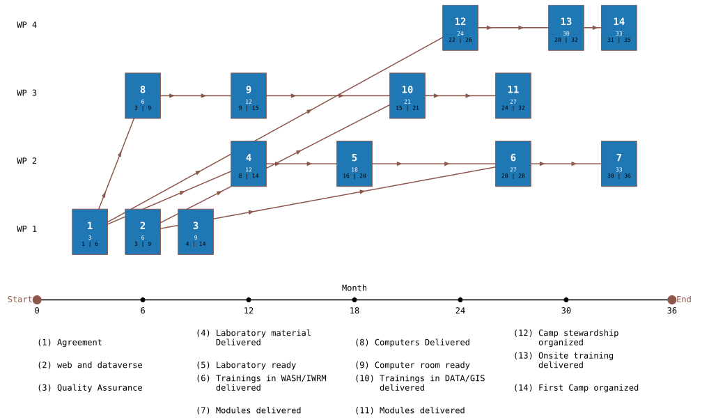
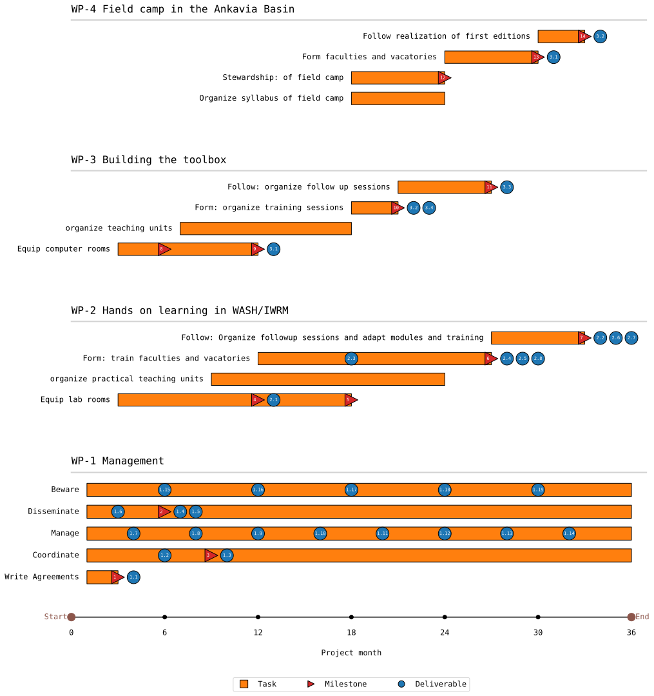

# pyPG a library to draw PERT and GANTT charts

pyPG is a simple library used to draw PERT and GANTT charts using matplotlib.
The project information is stored in a simple MariaDB (MySQL) database.

the library consists of one class (Milestone) and two functions PERT and GANTT that can be quite easily customized.

To use pyPG you need to have a working knowledge of MariaDB/MYSQL servers in order to input your project data into the base.


## Installation and usage

1 copy the python file wherever you want
2 load the database structure provided in the src dir in your MariaDB/MYSQL server using

```bash
mysql -u<user> -p<passwd> < myPERT.sql
```
than just run
```bash
python  pyPG.py
```
The resuting charts are stored by default in your src directory.

A sample project is included that produces the following charts.







You can also edit the python file and run it. Parameters are simple to modify according to your taste.


## Database structure:

### Introduction
 the database is organized in six tables, five of which are traditional and common to any research or education project.

 | Table | Role|
 |---|---|
| projects         | list of projects |
| wps              | list of work packages|
| tasks            | list of tasks |
| milestones       | list of milestones |
| deliverables     | list of deliverables|
| correl           | list of correlations between milestones|


Each table is relatively straightforward and simple, links are established using id fields
* pid = project id,
* wid = workpackage id
* tid = task id
* mid = milestone id
* did = deliverable id

### table defs

The field names should be easy to catch hopefully. pyPG is not (yet) a project management software so the tables have been kept simple (for now).

#### projects
| Field   | Type         | Null | Key | Default | Extra          |
|---|---|---|---|---|---|
| pid     | int(11)      | NO   | PRI | NULL    | auto_increment |
| pname   | varchar(255) | NO   |     | NULL    |                |
| comment | varchar(255) | YES  |     | NULL    |                |

#### wps
| Field   | Type         | Null | Key | Default | Extra          |
|---|---|---|---|---|---|
| wpid    | int(11)      | NO   | PRI | NULL    |       |
| wpname  | varchar(255) | NO   |     | NULL    |       |
| pid     | int(11)      | NO   | PRI | NULL    |       |
| wpstart | int(11)      | YES  |     | NULL    |       |
| wpend   | int(11)      | YES  |     | NULL    |       |

#### tasks
| Field   | Type         | Null | Key | Default | Extra          |
|---|---|---|---|---|---|
tid   | int(11)      | NO   | PRI | NULL    |       |
| tname | varchar(255) | YES  |     | NULL    |       |
| wid   | int(11)      | NO   | PRI | NULL    |       |
| pid   | int(11)      | NO   | PRI | NULL    |       |
| sdate | int(11)      | NO   |     | NULL    |       |
| edate | int(11)      | NO   |     | NULL  

####  milestones

Milestones are a bit more complex due to the necessity to include three dates, the estimated, the best (here min_t) and the worst (max_t).

| Field   | Type         | Null | Key | Default | Extra          |
|---|---|---|---|---|---|
mid   | int(11)      | NO   | PRI | NULL    | auto_increment |
| mname | varchar(255) | NO   |     | NULL    |                |
| t     | int(11)      | NO   |     | NULL    |                |
| min_t | int(11)      | YES  |     | NULL    |                |
| max_t | int(11)      | YES  |     | NULL    |                |
| wid   | int(11)      | NO   |     | NULL    |                |
| pid   | int(11)      | NO   |     | NULL    |                |
| tid   | int(11)      | NO   |     | NULL    |   

#### deliverables

| Field   | Type         | Null | Key | Default | Extra          |
|---|---|---|---|---|---|
did   | varchar(10) | YES  |     | NULL    |       |
| dname | varchar(55) | YES  |     | NULL    |       |
| pid   | int(11)     | YES  |     | NULL    |       |
| wid   | int(11)     | YES  |     | NULL    |       |
| tid   | int(11)     | YES  |     | NULL    |       |
| dd    | int(11)     | YES  |     | NULL    |       |
| mid   | int(11)     | YES  |     | 0       |       |

The mid field in this tables offers the possibility to correlate deliverables to milestones if needed

#### correl

this table is a bit particular as it establishes the dependencies existing between milestones for the PERT diagrams.

| Field   | Type         | Null | Key | Default | Extra          |
|---|---|---|---|---|---|
mid_target  | int(11) | NO   |     | NULL    |       |
| mid_depends | int(11) | NO   |     | NULL    |       |
| pid         | int(11) | NO   |     | NULL    |       |
